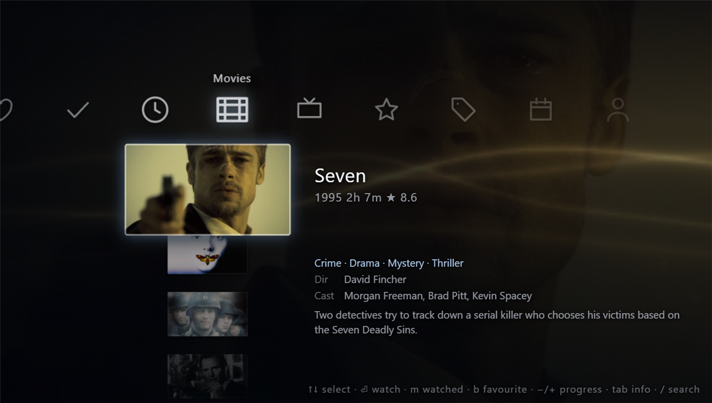

<div align="center">

# XMDB — your IMDb watchlist as a PSP XMB

**A pixel-space clone of the PSP's XrossMediaBar, driving an IMDb watchlist instead of a Memory Stick. Your films become games: backdrop icons, trailers playing inside the tile, save-data badges, and the cursor blips synthesised in the Web Audio API.**

[**→ Open the live demo**](https://moeezalam.github.io/xmdb/)

[](https://moeezalam.github.io/xmdb/)


[](LICENSE)

[](https://moeezalam.github.io/xmdb/)

<sub>The live demo, running the bundled 32-title library. No install, no key, no account.</sub>

</div>

---

A pixel-space clone of the PSP's XrossMediaBar game menu, driving an IMDb
watchlist instead of a Memory Stick.

Everything is authored against a **480 × 272 logical canvas** — the PSP's real
screen — and scaled to the viewport by one CSS transform. There are no
breakpoints: a `12px` font in the stylesheet is 12 PSP pixels, and the whole UI
letterboxes into any window at the correct aspect ratio.

## The slot mapping

The PSP's PBP container already defines the data model this needs, so each movie
is dressed as a game rather than as a web card:

| PSP slot | Native size | Filled with |
| --- | --- | --- |
| `ICON0.PNG` | 144 × 80 | TMDB backdrop, cropped into the tile |
| `ICON1.PMF` | animated icon | Muted trailer, playing **inside the tile** after a 700 ms dwell |
| `PIC1.PNG` | 480 × 272 | Full-bleed backdrop, cross-faded with a Ken Burns pan |
| `PIC0.PNG` | 480 × 272 | The metadata plate under the selected row |
| `SND0.AT3` | audio | Synthesised cursor blips (see *Assets*) |

## Running it

```bash
npm install
npm run dev
```

The repo ships a **demo library** at `public/data/library.json` — 32 titles
spread deliberately across 11 decades, 22 genres and 22 directors so that every
column has something in it — with artwork and trailers already fetched.

### Running it against your own watchlist

Build your library to `public/data/library.local.json`, which the app prefers
when it exists and which is gitignored:

```bash
npm run library -- "path/to/Watchlist.csv" --local
```

The demo stays in `library.json` for the public site; your list never leaves
your machine. `public/` is copied verbatim into `dist`, so a Vite plugin also
strips `library.local.json` from the build output — git ignoring it alone would
still let a local `npm run build` publish it.

Or skip the file entirely and use *Settings ▸ Import Watchlist CSV* in the app,
which stores the result in IndexedDB.

## Controls

| | |
| --- | --- |
| `↑` `↓` / D-pad / left stick | Move within the column |
| `←` `→` | Change category, or leave a sub-column |
| `PgUp` `PgDn` / `L1` `R1` | Jump 12 rows |
| `Home` `End` | Jump to the ends |
| `Enter` `Space` / `✕` | **Watch** — opens the title on your search site in a new tab |
| `M` / `□` | Toggle watched |
| `B` / `R3` | Toggle favourite |
| `−` `+` (or `[` `]`) | Progress ∓10% |
| `Tab` / `△` | Info page |
| `Esc` `Backspace` / `○` | Back |
| `/` / `Start` | Search — then just type |
| `C` | Calibration overlay |

Clicking a tile selects it; clicking the tile that is already selected watches it.
The tile is a real link, so middle-click and "copy link address" work too.

## Save data

Every title carries three marks, shown as PSP-style save-data badges on its
tile: a **✓ watched** dot, a **★ favourite** dot, and a progress bar along the
bottom edge. Watched tiles are desaturated until selected.

Marking watched sets progress to 100%; taking progress to 100% marks it
watched. Launching a title stamps it so **Continue** can order by most recently
opened. Three categories are driven by this: **Continue**, **Favourites** and
**Watched**. *Settings ▸ Hide Watched Titles* drops them out of the browsing
categories without touching the save-data ones.

Marks live in their own IndexedDB key, separate from the library, so
**importing a new CSV never touches them** — they are keyed by IMDb id and
re-attach to whatever list you load next. Verified: after replacing a 711-title
library with a 2-title CSV, both marked titles' data survived intact.

*Settings ▸ Export Save Data* writes a JSON backup; *Import Save Data* merges
one back in, newest-`updatedAt`-wins. *Clear Save Data* is the only destructive
action and it asks first.

Auto-repeat accelerates: one step, a 380 ms pause, then an interval ramping down
to 55 ms. That curve is the single biggest tell that a clone is or is not a PSP,
so it lives in `src/lib/layout.ts` with everything else worth tuning.

## Loading a different watchlist

**In the app** — *Settings ▸ Import Watchlist CSV*, then drop an IMDb export.
It is parsed in the browser and stored in IndexedDB, overriding the bundled
library until you reset. Watchlist, ratings and custom-list exports all work;
columns are matched by header name, not position.

Get the file from IMDb ▸ Your Watchlist ▸ ⋯ ▸ Export.

**From the command line** — regenerate a bundled library instead:

```bash
npm run library -- "path/to/Watchlist.csv" --local
```

That fetches artwork from Cinemeta as it goes. Drop `--local` to overwrite the
demo in `library.json`. Set `TMDB_API_KEY` on the command to add a TMDB
fallback pass for anything Cinemeta misses. `scripts/make-demo.ts` regenerates
the demo set from a local library.

> **IMDb list URLs are not supported.** IMDb has no public API, and its list
> pages cannot be read from the browser (CORS) or scraped reliably from Node
> without breaking on every layout change. The CSV export is the only stable
> path, so that is the only one wired up.

## Changing where "Watch" sends you

*Settings ▸ Watch Link* takes any URL template. Placeholders:

| | |
| --- | --- |
| `{title}` | the title text |
| `{year}` | release year, empty if unknown |
| `{imdb}` | the IMDb const, e.g. `tt0111161` |

A URL with no placeholder is treated as a prefix and the title is appended, so
pasting a bare search URL out of the address bar works. Spaces become `+`
inside a query string and `%20` in a path segment, picked per placeholder
position, so both `?q={title}` and `/search/{title}/` produce something the
target site accepts. The dialog previews the real URL for the selected title as
you type, and ships presets for movies2watch, IMDb, TMDB, Letterboxd,
JustWatch, YouTube and Google.

Only `http` and `https` templates are accepted — a `javascript:` template would
turn a stored setting into script that runs on every launch.

## Artwork and trailers

The CSV has no images, so they are fetched from **Cinemeta**, Stremio's public
metadata addon. It needs no API key, is keyed directly by IMDb id, and returns
poster, backdrop, logo, cast, overview and a YouTube trailer id in one request.
The bundled library already has all of it — 710 of 711 titles with artwork, 688
with trailers.

*Settings ▸ Fetch Artwork & Trailers* re-runs it, ten requests in flight,
cancellable. *Re-fetch Everything* forces a refresh of rows that already have
art.

A **TMDB key is optional**. If one is set under *Settings ▸ TMDB Key*, it runs
as a second pass over whatever Cinemeta could not fill. Either a v3 API key or a
v4 read token works; the shape is detected. It is stored in this browser only.

### The trailer tile

Trailers are YouTube, because YouTube ids are what both providers hand out.
Getting them to look like a PSP animated icon rather than an embedded video
took three things:

- **A dwell before starting.** The selection has to sit still for 2 s, and the
  player is then revealed only once it reports `PLAYING` and holds it for a
  further 900 ms. The card and its artwork are on screen for roughly three
  seconds before anything moves.
- **Rendering the player large, then scaling it down.** At the tile's ~112 px
  width YouTube switches to a tiny-player layout where the video title and the
  centre play button fill the frame. Built at 640×360 and scaled by ~0.6, the
  chrome is normally proportioned.
- **Cropping to a clean band.** YouTube keeps drawing chrome over playing video
  — traced it: the player reports `PLAYING` once and never pauses, yet the
  transport controls sit across the middle and a "More videos" strip across the
  bottom. Measured against player height the chrome occupies about 0–0.12,
  0.44–0.56 and 0.80–1.0, so the tile is positioned in the clean band at 0.28.

Region-locked or embedding-disabled videos never reach `PLAYING`; the still
artwork stays underneath, so it degrades to "no motion" rather than a hole.

## Layout and calibration

`src/lib/layout.ts` holds every coordinate in the app; nothing else hardcodes a
position.

The cross geometry is calibrated against a real XMB frame. The reference was
scanned for bright, low-saturation UI pixels and the band centres taken:

| Measured band | Centre, in 480×272 space | Constant |
| --- | --- | --- |
| item column, x 117–130 | 140.8 | `CROSS_X` |
| category row, y 59–69 | 73.8 | `CAT_Y` |
| category centres 88…451 | mean gap 51.9 | `CAT_SPACING` |

The reference is a PS3 XMB, so the cross geometry is right but the column is
not: a PSP Game column carries 144×80 `ICON0` artwork, not 24px glyphs, so
`ITEM_SPACING` and the tile sizes are driven by that artwork instead.

To finish against a PSP specifically: run PPSSPP at 1×, screenshot the Game
menu, save it as `public/calibration.png`, and press `C`. The overlay draws it
over the live UI with a 20px grid and crosshairs on `CROSS_X`, `CAT_Y` and
`SEL_Y`; `[` and `]` change its opacity, `G` toggles the grid. Tune the
constants until they line up.

## Assets

Nothing here is Sony's.

- **Sounds** are synthesised from oscillators at call time through the Web Audio
  API — element playback latency is tens of milliseconds and the cursor feel
  dies with it. The real XMB blips are not redistributable.
- **Icons** are drawn as SVG paths in `src/components/Icons.tsx`.
- **The wave** is an original WebGL shader: phase-offset ribbons rendered as
  inverse-distance glow over a vertical gradient, plus drifting motes. Its
  month-driven palette approximates the firmware's by eye; it is not a rip.
- **The font** falls back to the nearest light humanist sans the OS already has.
  The real face is SCE-PS3 Rodin, licensed from Fontworks and not
  redistributable.

XrossMediaBar, XMB, PSP and PlayStation are trademarks of Sony Interactive
Entertainment Inc. This is an independent tribute, not affiliated with or
endorsed by Sony. The code is MIT licensed; see [LICENSE](LICENSE).

Movie metadata and artwork are fetched at runtime from Cinemeta, and optionally
from TMDB under your own key. This product uses the TMDB API but is not endorsed
or certified by TMDB. The watch link is a plain search query against a
third-party site; nothing is hosted, proxied or embedded here.

## Tests

```bash
npm test
```

37 checks with `fetch` stubbed, so they test the code in this repo rather than a
provider's uptime:

- **CSV parser** — quoted commas, escaped quotes, BOM, CRLF, duplicate ids,
  column reordering, rejection of non-IMDb files.
- **Cinemeta** — poster size upgrade, trailer-source precedence, cast cap,
  CSV fields staying authoritative, the movie/series fallback, 404 handling,
  per-title failure isolation.
- **TMDB** — auth-shape detection, trailer ranking, logo selection, TV vs.
  movie routing, 429 retry, failure isolation, cancellation.
- **Watch link** — query vs. path space encoding, accents and punctuation,
  `{year}`/`{imdb}` substitution, missing-year handling, prefix-only templates,
  repeat-call stability, `javascript:`/`data:` rejection, and every shipped
  preset validating and building.

## Layout of the source

```
scripts/
  build-library.ts   CSV -> public/data/library.json, optional TMDB enrichment
  test-enrich.ts     offline tests
src/lib/
  layout.ts          every coordinate and timing constant
  csv.ts             RFC4180 parser + IMDb column mapping
  cinemeta.ts        default artwork provider, no key
  tmdb.ts            optional fallback provider
  searchLink.ts      watch-link templates, encoding, validation
  menu.ts            categories, grouping, search
  wave.ts            WebGL background
  input.ts           keyboard + gamepad, accelerating repeat
  audio.ts           synthesised SFX
  storage.ts         IndexedDB library, localStorage settings
  art.ts             image URLs, placeholder gradients
src/components/
  Screen.tsx         the 480x272 canvas and its one transform
  Xmb.tsx            the cross; per-frame transforms written straight to the DOM
  Backdrop.tsx       PIC1 crossfade
  InfoPanel.tsx      PIC0 plate
  Trailer.tsx        ICON1 tile
  Detail.tsx         full-screen title page
  Dialog.tsx         import / key / link / progress modals
  Calibration.tsx    reference overlay, grid and crosshairs
  SaveBadge.tsx      watched / favourite / progress marks
```

React owns discrete state — which index is selected. Per-frame transforms are
written to the DOM from a single `requestAnimationFrame` loop in `Xmb.tsx`;
re-rendering fifteen nodes at 60 Hz through React would cost more than the rest
of the app combined. Only about fifteen rows exist in the DOM at a time
regardless of library size.
